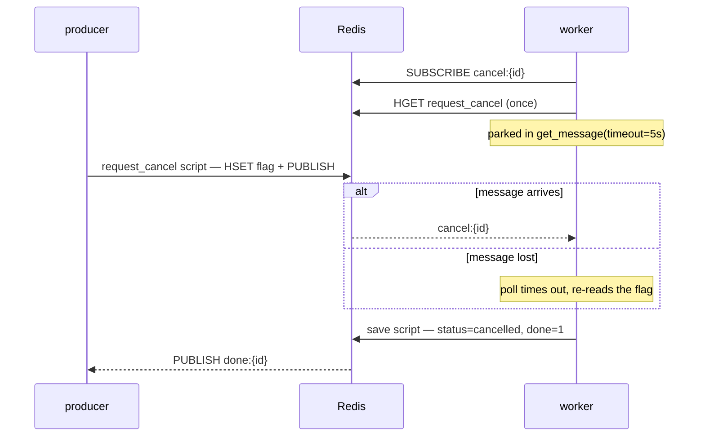

# Architecture

How TaskQueue is put together, and — more usefully — why each piece is shaped the
way it is. Most of the interesting decisions are about *races*: what two processes
can be doing at the same instant, and what happens when one of them dies in the
middle.

Written against v0.4.0. Where a rule is enforced by a test, the test is named, so
you can read the executable version of the claim.

---

## The shape

Three roles, which are usually three processes:

- A **producer** opens a scope (`JobGroup`), spawns jobs into it, and waits for
  their results.
- The **backend** is the only thing all of them share. It is a `typing.Protocol`
  of eleven methods; `RedisBackend` is the real one and `MemoryBackend` is the
  single-process one.
- A **worker** claims jobs, runs them, and writes back terminal states.

Nothing else is shared. Producers and workers never talk to each other directly,
and neither holds a reference to the other's objects — everything travels as a
record through the backend. That is what makes the same scope code work whether
the worker is a coroutine in the same event loop or a process on another machine.

```
producer                        Redis                      worker
────────                       ───────                    ────────
group.spawn(task, …) ─enqueue script──▶ queue
                                       jobs:{id}
                                                ◀───BLMOVE──── claim()
                                       processing:{worker}
                                                ◀─claim script─ mark RUNNING
                                                               run the coroutine
                                       jobs:{id}
                                                ◀─save script── save(done=True)
handle.result() ◀──PUBLISH done:{id}───┘
```

## The record

One Redis hash per job, at `jobs:{id}`. `Job.to_record(serializer)` produces it and
`Job.from_record(record, serializer)` reads it back; the backend never deserializes
a payload.

| field | type | notes |
|---|---|---|
| `id`, `task_name`, `created_at` | `str` | identity |
| `status` | `str` | `queued` / `running` / `completed` / `failed` / `cancelled` |
| `attempts` | `str` of int | times handed to a worker; `1` while it first runs |
| `request_cancel` | `"0"` / `"1"` | the durable half of the cancel signal |
| `group_id` | `str`, optional | the scope that spawned it, absent if detached |
| `payload` | `bytes` | `{"args": [...], "kwargs": {...}}`, serializer blob |
| `result` | `bytes`, optional | present only once `status` is `completed` |
| `error` | `str`, optional | present only once populated |

Two rules follow from Redis storing only strings and bytes, and both have cost real
debugging time:

- **An absent key means `None`.** `from_record` must use `.get()`. Indexing an
  optional field directly raises `KeyError` inside the worker's claim path, where it
  is caught by the "poison record" handler — the job is dropped and the worker keeps
  serving, so the symptom is a producer that waits forever with nothing in the log to
  explain it.
- **`"0"` is truthy.** Every read of `request_cancel` goes through `int()` before
  `bool()`. The same trap ate a `group_id = "0"` sentinel once.

## The key space

| key | type | holds |
|---|---|---|
| `queue` | list | job ids waiting to be claimed |
| `jobs:{id}` | hash | the record above |
| `processing:{worker_id}` | list | the leases one worker process currently holds |
| `workers` | zset | `worker_id → unix timestamp of last heartbeat` |
| `done:{id}` | pub/sub | published once, by the terminal write |
| `cancel:{id}` | pub/sub | published once, by a cancel request |

Keys are module constants, not per-`Queue` values: `Queue(namespace=…)` prefixes
*task names*, never backend keys, so two logical queues on one Redis database share
a keyspace. Flush between runs of any example. (A `key_prefix` on `RedisBackend` is
an open improvement.)

## Why every check-then-act is a Lua script

`MULTI`/`EXEC` cannot branch. Inside a pipeline `pipe.hget(...)` returns the
pipeline, not a value, so "if the job still exists and is not terminal, then write"
cannot be expressed — you would have to read, decide in Python, and write hopefully,
with the whole race back in the gap. Redis runs a script atomically, so every guard
in the backend is one: `enqueue`, `claim`, `save`, `release`, `request_cancel` and
`reap` are all registered scripts.

`heartbeat` is a script for a different reason. It has nothing to branch on, but it
needs `redis.call('TIME')`, so the timestamp comes from the **server's** clock. Read
from the worker's instead, the reaper's arithmetic would be comparing two machines'
clocks, and a worker running a few seconds fast would be reaped while it was alive and
serving.

`take_result`'s fetch-and-free (`HGETALL` + `DEL`) is the one that stays a plain
`MULTI`: it has nothing to decide.

## Reliable delivery

`claim()` is `BLMOVE queue → processing:{worker_id}`, blocking for at most one
second. That single command is the lease: the id leaves the queue and lands on
exactly one worker's list, atomically, across processes.
`test_two_worker_processes_split_jobs` is the proof that fakeredis cannot give — it
lives inside the test process, so it can say nothing about atomicity *between*
processes.

The one-second bound is not a tuning knob, it is what makes a graceful drain
possible: a worker parked forever inside `claim` could never observe a shutdown
request, so `drain()` would hang on a pool that is by definition idle.

**The lease takes two round trips, and that is unavoidable.** Lua cannot block, so
the wait (`BLMOVE`) and the state write (mark `RUNNING`, increment `attempts`)
cannot be one script. Everything below follows from that gap:

- **A worker killed between them** leaves the id on its processing list with the
  record still `queued`. The reaper requeues it regardless of status, so it is
  redelivered — the status reset is simply skipped for that one.
- **`attempts` is counted by the claim script, not by the reaper.** Counting a lost
  lease at reclaim time cannot be exact: the half-delivery above was never handed to
  anything that could act on it. Counting at delivery makes that window
  *uncountable* rather than *uncounted* — a job could otherwise be delivered twice
  and still report `attempts=0`.
- **An error on the second round trip used to keep the lease forever.** The worker
  logs and claims again, and it stays alive and beating — which is precisely what
  keeps every reaper away (see below). `claim` now returns the id to the queue in
  one `MULTI` before re-raising. `test_a_failed_claim_returns_the_lease_to_the_queue`.

A terminal `save(done=True)` `LREM`s the id off the processing list in the same
script that writes the status: the ack and the outcome cannot come apart.
`release()` is the nack — it moves a `running` job back to `queued`, and is a no-op
for anything else, so a shutdown racing a reaper is harmless rather than a duplicate.

## The reaper

Every worker runs an upkeep loop: `heartbeat()` then `reap()`, every
`heartbeat_interval` seconds. `heartbeat` `ZADD`s `worker_id → now` into `workers`;
`reap` walks `ZRANGE workers -inf (now - worker_ttl) BYSCORE` and, for each expired
member, drains `processing:{that worker}` back onto the queue, resetting `running` to
`queued`, then `ZREM`s it. Both take `now` from `redis.call('TIME')` inside the
script, so the two sides of that comparison come from one clock.

**It takes no distributed lock, deliberately.** The whole reclaim is one atomic
script, so two reapers racing cost a wasted round trip, not a duplicated job. A lock
would only add a way to be wrong: one that expired mid-operation would break the
exact property it was there to protect.

Two orderings hold the protocol together, and both were once missing:

- **A worker registers before it can claim.** `Worker.__aenter__` `await`s one
  heartbeat *before* starting any claim loop. They used to be sibling
  `create_task`s, which raced the first `ZADD` against the `BLMOVE`; under load the
  claim won by 4–17 ms. A `SIGKILL` in that window strands the job for good, because
  `reap` walks expired **members** and nothing else — a lease whose owner is not in
  the zset is invisible to every reaper there will ever be.
  `test_a_worker_registers_before_it_can_claim`.
- **A pool deregisters last.** `__aexit__` cancels the claim loops, waits for them —
  each one `release`s its in-flight lease on the way out — and only then stops the
  upkeep loop. Stopping upkeep first would let this worker's beat lapse while it is
  still handing leases back, and a peer would reclaim jobs still running here.
  `test_the_pool_keeps_beating_until_the_last_lease_is_handed_back`.

`Worker.__init__` refuses a `heartbeat_interval` that leaves no margin against the
backend's `worker_ttl` (three beats per TTL), raising `ConfigError`. Without it a
pool can be *configured* to have its own running jobs reclaimed by peers. Note what
this does **not** cover: the beat shares an event loop with the jobs, so a CPU-bound
synchronous task can starve it whatever the ratio. Liveness here is a heuristic, not
a fence: good enough to reclaim a lease from a process that has stopped, and not good
enough to decide that work somewhere else should be thrown away.

## Result delivery

`take_result(job_id)` blocks until the job is terminal, then returns the record and
deletes it in one `MULTI`. Fetch-and-free is a single call so results stay bounded
for anyone who consumes them; `result_ttl` (default one day) bounds the ones nobody
does, via an `EXPIRE` set by the terminal write.

The wait is **subscribe first, then look**:

```python
async with self.redis.pubsub() as pubsub:
    await pubsub.subscribe(done_channel(job_id))
    # the record is the truth, the message is only the news.
    while not await self._is_terminal(job_id):
        message = cast(
            "dict[str, Any] | None",
            await pubsub.get_message(timeout=_NOTIFY_POLL_SECONDS),
        )
        if message is not None and message["type"] == "message":
            break
```

Checking the status before subscribing would leave a gap: Redis pub/sub is
fire-and-forget, so a job finishing in that window publishes to nobody and the
message is gone for good — unlike an `asyncio.Event`, which stays set.
`test_a_publish_with_no_subscriber_is_not_replayed` pins the ordering.

Subscribing first closes the gap but not the hole. A dropped `PUBLISH` — a
connection blip, a failover — leaves the record correct and the waiter parked
forever. So the wait re-reads the durable state every `_NOTIFY_POLL_SECONDS` (5s) —
the rule the comment in that loop states. Five seconds is chosen as a backstop, not a
mechanism — one `HGET` per waiting job per interval, forever,
against a few seconds of extra latency in a failure that should almost never happen.

## Cancellation delivery

A cancel is a durable flag *and* a notification, written by one script so no reader
can see them apart:

```lua
if redis.call('EXISTS', job) == 0 then
    return 0
end

if terminals[redis.call('HGET', job, 'status')] then
    return 0
end

redis.call('HSET', job, 'request_cancel', '1')
redis.call('PUBLISH', channel, '')
```

Refusing a terminal job is what makes **completion win over a late cancel**, and it
makes `request_cancel` idempotent: cancelling a finished or already-consumed job is
a no-op, not an error.

The worker side is two sibling tasks — the job coroutine and a `wait_cancel` watcher
— raced with `asyncio.wait(FIRST_COMPLETED)`:



Three subtleties, each of which has been a bug:

- **The one-shot read covers the job that was cancelled while queued**, and the
  window between the claim and the subscription. `wait_cancel` subscribes, reads the
  flag once, and only then parks — so a cancel arriving at any point is caught by
  one path or the other. A test that fires its cancel the instant the job starts is
  answered by that one-shot read and never exercises the transport at all; the
  cross-process tests gate on `PUBSUB NUMSUB` to get past it.
- **A missing record means the job finished, not that it was cancelled.** The poll's
  re-read reports `False` for a record that is gone — deliberately the opposite of
  `take_result`'s, which raises. The worker reads *any* return from `wait_cancel` as
  a cancellation, so answering `True` there would stamp `cancelled` on a job nobody
  cancelled. Waiting on is safe: the worker cancels that watcher itself the moment
  the job settles.
- **A watcher that *raised* is not a watcher that *fired*.** `asyncio.wait` reports
  "done" for both, so a dropped connection used to be read as a cancellation and
  written over work that was still running. The worker now checks
  `cancel_task.exception()` and finishes the job unwatched instead.
  `test_a_broken_cancel_watcher_does_not_cancel_the_job`, paired with
  `test_a_returning_cancel_watcher_still_cancels_the_job` so it cannot be satisfied
  by ignoring the watcher altogether.

## Scopes across processes

`JobGroup` is the structured-concurrency scope. Everything it does is ordinary
Python in the *producer* process — there is no scope object anywhere else.

- `spawn` enqueues through `Task.submit(group_id, job_id, /, *args, **kwargs)`, the
  only enqueue there is. Both are positional-only and leading because that is the one
  shape `ParamSpec` allows next to `*args: P.args`: a keyword-only parameter would
  collide with any task that has a parameter of the same name, and a trailing
  positional would be swallowed by `P.args`.
- Inside an entered scope, `spawn` also creates a local waiter task on
  `handle.result()`. `__aexit__` joins those waiters; that is what makes the block
  refuse to exit while a child is still running.
- **Fail-fast fans out from the waiter, not from `__aexit__`.** A done-callback on
  the first failing waiter issues one `request_cancel_many` for the still-running
  siblings immediately, so cancellation starts while the scope body is still running
  rather than when it finally reaches the join.
- **`group_id` is stamped, and read by nothing.** It is the wire-visible difference
  between a spawn into an entered scope and a deliberate detachment via
  `root_group()`, which stamps `None`. It costs one optional record field and it is
  what `taskqueue inspect` will read.
- **Teardown is bounded.** `cancel_all_jobs` requests cancellation in one batch, then
  waits at most `_CANCEL_DRAIN_TIMEOUT_SECONDS` (30s) for the children to report
  back, logging a warning if they do not. The wait is the scope's promise, but it
  rides on a wake-up that a dropped notification can swallow — and a hang inside
  `finally` outlives even `pytest-timeout`.

## Nesting: a task that is itself a producer

A task can open a scope of its own:

```python
@q.task
async def check_inventory(item: str) -> str:
    async with q.group() as warehouses:
        counts = [await warehouses.spawn(check_warehouse, item, n) for n in STOCK]
    return summarise([await count.result() for count in counts])
```

Nothing in `Worker` special-cases this. It awaits `task(*args, **kwargs)` and does
not care what the coroutine does, so `async with q.group()` is the same construct
inside a job as inside a script. That is what makes the scope a *tree* rather than
one level of fan-out, and it is why `group_id` is on the record: the shape is
visible on the wire, not only in the producer's memory.

Cancellation follows the tree down. Cancelling a parent interrupts its task, which
surfaces as a `CancelledError` inside its scope's join, and the arm of `__aexit__`
that catches it is what tears the children down — so a cancel aimed at one job
reaches the jobs that job spawned. `test_cancelling_a_parent_job_cancels_the_children_it_spawned`.

Two things to know before relying on it.

### The pool has to be wider than the tree is deep

**A parent occupies a worker slot for the whole time it waits on its children.**
That makes pool width a correctness constraint rather than a throughput knob.
Measured against `examples/nested_scopes_cancel_on_failure.py`, which has three outer checks, one of which
spawns three warehouse jobs:

| `concurrency` | outcome |
|---|---|
| 1 | **deadlocks** — never completed; the parent holds the only slot and no child can be claimed |
| 2 | completes, 13s |
| 6 (3 + 3) | completes, 4s |

So: at least two to finish at all, and parent + children at the widest point of the
tree for full fan-out. This is the familiar "never block a pool worker on work
submitted to the same pool" hazard, and the failure mode is unhelpful — the run
simply never finishes, with nothing in the log.

### A re-run body re-attaches to its children instead of forking

At-least-once delivery means any task body can run twice. A leaf task only has to
be idempotent in its own effects, but **a spawning task has an enqueue as a side
effect**, and an enqueue that is not deduped creates a second set of children while
the first set is still running, owned by nobody. Measured before the fix — release a
nested parent's lease, which is exactly what a reaper does after its worker is
killed:

```
after first delivery, children started: ['child-0', 'child-1']              3 job records
parent released back to the queue (as a reaper would)
after redelivery,     children started: ['child-0','child-0','child-1','child-1']   5 job records
```

Two halves close it, and neither works alone.

**Child ids are derived from the parent's.** `Worker._process` puts a `JobContext`
in a `ContextVar` before it creates the task — before, because a task copies the
context at *creation*, so anything set afterwards is invisible to the body — and
`JobGroup.spawn` seeds each child's id on it:

```python
sha1(f"{parent.job_id}:{parent.next_spawn()}".encode()).hexdigest()[:32]
```

`next_spawn` counts per **body**, not per scope. A scope's id is a fresh `uuid4`
on every construction, so it cannot appear in a seed that has to survive a re-run;
and counting per body is what stops two sequential scopes in one body from both
claiming ordinal 0. This asks of a task body what a workflow engine asks of a
workflow: that a re-run issues the same sequence of spawns. A spawn with no job in
context — a producer script — returns `None` and `Job` falls back to `uuid4`, so two
identical spawns from a script still get distinct ids.

**`enqueue` refuses an id it already knows.** It became a Lua script for exactly the
reason in the section above: `EXISTS` then `HSET`+`RPUSH` is a check-then-act, and
`MULTI` cannot branch. Skipping the record write but still pushing the id would be worse
than no guard at all — the job would be claimed twice — so the test asserts through
`claim`, not through the record. `tests/test_child_ids.py` covers both halves and
the consequence; removing either one turns two children back into four.

What this does *not* make safe is a redelivery that overlaps its predecessor. Two
live bodies of one job contend for the same children's results, and `take_result` is
single-consumer, so one of them waits forever. The reaper only redelivers a job whose
worker is already gone, so the paths that exist today do not produce that — but a
retry that fires while the first attempt is still running would, which is a
constraint on Phase 5 rather than a solved problem.

## What survives a crash

| what dies | what happens |
|---|---|
| a job raises | siblings cancelled, `BaseExceptionGroup` out of the `async with` |
| the scope body raises | children cancelled, then the exception propagates |
| the deadline passes | children cancelled, `TimeoutError` |
| the owning task is cancelled (Ctrl-C) | children cancelled, `CancelledError` re-raised |
| a **worker** process is `SIGKILL`ed | peers notice the missing beat after `worker_ttl` and requeue its leases |
| a **producer** process is `SIGKILL`ed | its jobs run to completion; results expire unread |

The last row is a deliberate boundary, not a gap. Noticing a dead producer would mean
inferring its liveness from a heartbeat, and — as in the reaper section above — a beat
that goes quiet because a process is busy looks exactly like one that went quiet
because it died. The cost of getting that wrong is cancelling work that is still
running, which is worse than paying for work nobody is waiting on.

Everything above the last two rows needs only that Python keeps running in the
producer, which is why `__aexit__` has an arm for every way out of the block.

## MemoryBackend

Same Protocol, same conformance suite — the `backend` fixture is parameterised, so
every scope property is checked twice. It is not a smaller Redis, though, and the
differences are the point:

- `heartbeat` and `reap` are no-ops. A single process cannot outlive its own leases,
  so there is no liveness protocol to run and no `worker_ttl` to check against.
- Notification is an `asyncio.Event`, which cannot lose a wake, so none of the poll
  machinery exists there.
- Its queue is an `asyncio.Queue` in one event loop. A second process importing the
  module builds a *different* backend, so cross-process anything is impossible by
  construction. This is worth stating because the failure is silent: the producer's
  job sits in its own queue while the worker blocks on its own empty one.
